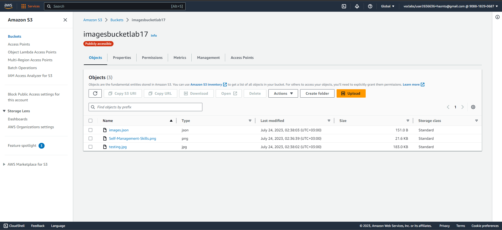
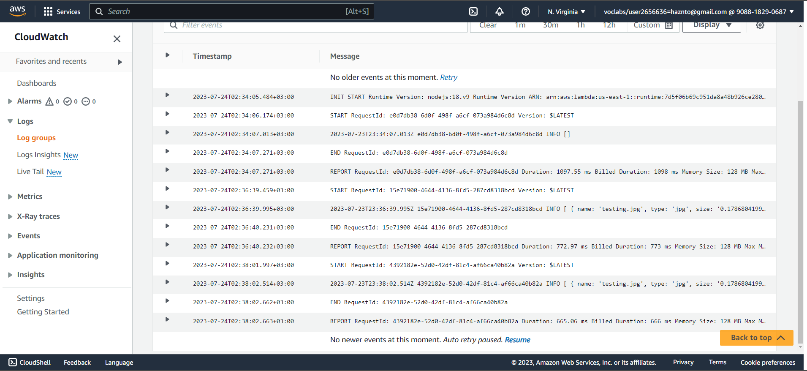
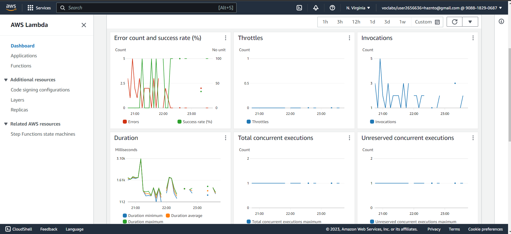
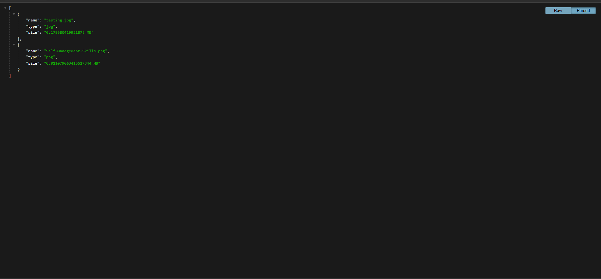

# image-lambda

## Description how to use

- Clone the repository on your local machine then `npm i` to install the packages, after that you compress the following files into zip file:

1. index.js
2. package-lock.json
3. package.json
4. node_modules (folder)

- Go to your AWS dashboard and create a bucket with it's suitable configurations, make sure to add a policy to make your image.json file allow reading automatically.

- Go for Lambda service and create new function, then upload the zip file as a code to execute.

- You might go through erros based on your bucket & lambda configs.

- Lastly go and upload images to your Bucket, you will see that the image.json file updates automatically, and if you didn't add a policy to allow reading , you will have to update the permissions for image.json file each time you upload a new image to make everyone able to read.

## Struggles

Many issue raised while solving the problem, of which not accepting certain syntax, and not accepting certain file naming. and many other code line errors like `Key doesn't exist` due to not matching object key with our bucket content. also due to stringyfing the objects we get from the bucket had to parse it lastly based on `utf-8` format

Link to JSON file:

https://imagesbucketlab17.s3.amazonaws.com/images.json

## Limitations

This function only support: .jpg,png,jpeg formats of adding images.

## Screen shots of the dashboard and result

